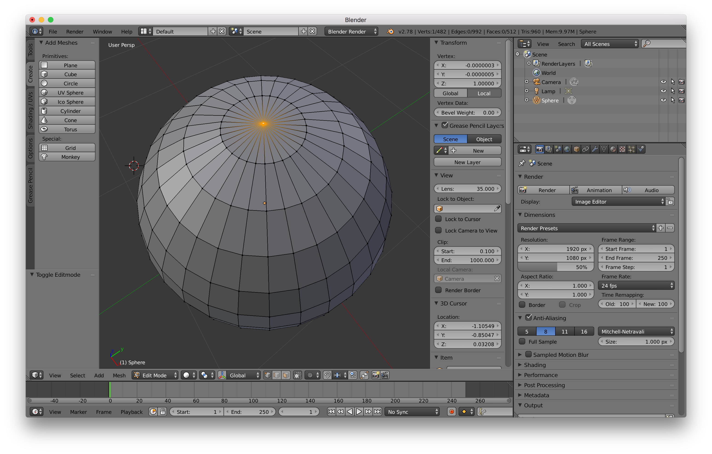
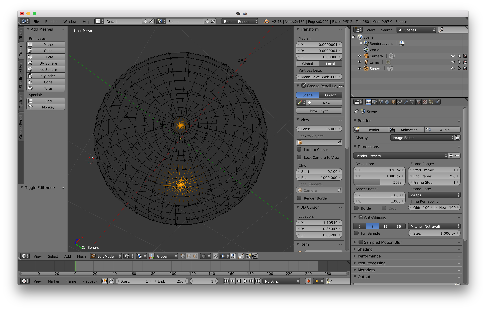
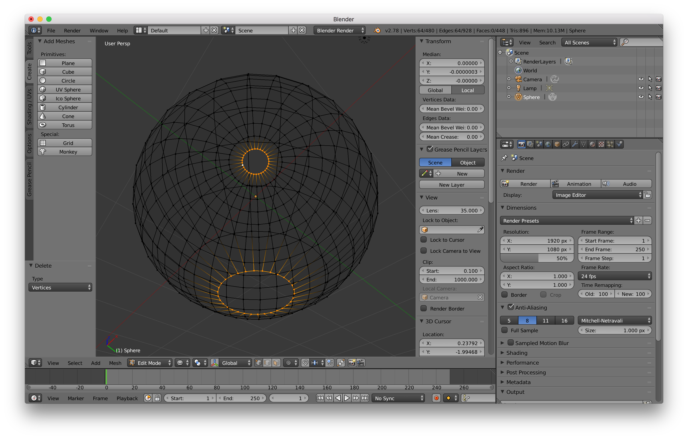
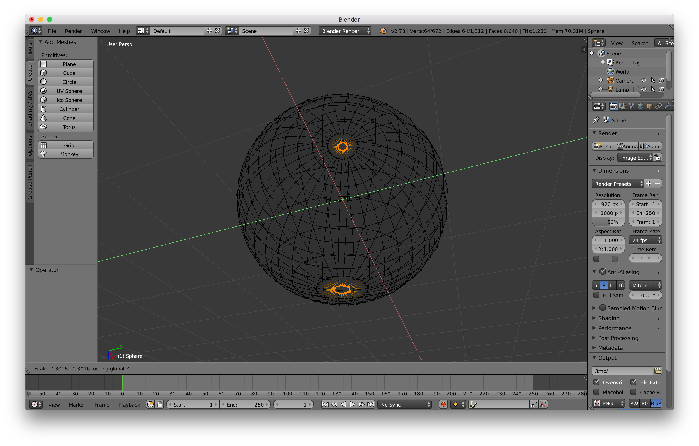
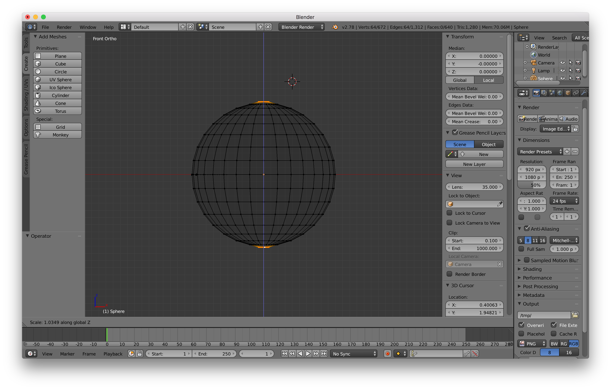
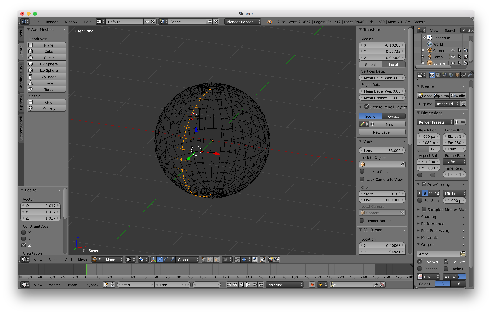
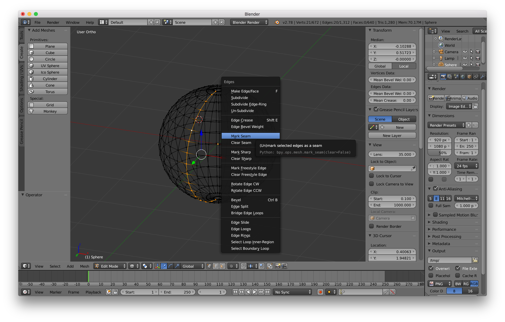
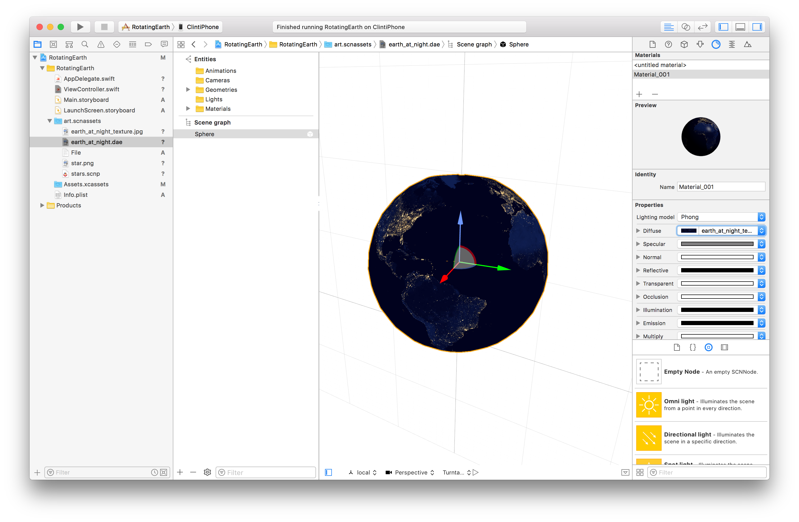

## Rotating Earth AR Snippet

Below are notes on both the design and development steps for creating the Rotating Earth Augmented Reality scene.

### Design Steps using Blender 3D

Below is the workflow used to created the 3D model of the Earth in this sample.  In a nutshell, we use NASA's 'Earth at Night' image as a texture to wrap onto a UV Sphere.  Below are the steps:

1) Open [Blender](https://www.blender.org).

2) Delete the default Cube.

3) Create a UV Sphere at location (0, 0, 0).

4) Start Edit Mode to start making changes to the UV Sphere.

5) Select the top vertex (see below)

6) Rotate the UV sphere and do [SHIFT] + [Right-Click] to also select the bottom vertex.

7) Confirm that both vertices are selected by switching the Viewport Shading to __Wireframe__ (see below).

8) Delete the two vertices tapping the [X] button and choose to delete __Vertices__.

9) Do [ALT] + [Right-Click] to choose the top edge.  Then do [SHIFT] + [ALT] + [Right-Click] to choose the bottom edge (see below).

10) Close the gaps by doing extrude [E] ... then scale [S] ... then [SHIFT] + Z and tight/close the holes (see below).

11) To remedy the 'flat top' of the UV sphere, do [Num Pad 1] + [Num Pad 5] ... then [S] ... then [Z] to bring up the top of the sphere (see below).

12) Select an edge of the sphere with ... [SHIFT] + [Right-Click] (See below).

13) Mark the selected edge as a Seam with ... [CONTROL] + [E] ... then choose __Mark Seam__ (see below).

14) Type the [A] button twice to select all elements of the UV Sphere ... switch from __Default__ view to __UV Editing__ (top-left drop down right of the Help menu) ... Type [U] and choose __Sphere Projection_.  Finally make sure that you check __Clip to Bounds__ under the Sphere Projection window (see below).  At this point, play with the various UV Mapping settings and choose the best one for your image/scenario.

15) Transition back from __UV Editing__ to __Default__ view.

16) Add a Material to the UV sphere.

17) Add a Texture to the UV sphere and choose a file (e.g. NASA's Earth at Night Image).

18) Turn off __Edit Mode__ and change Viewport Shading to __Texture__.  Then review your work.  Repeat step 14 until you are happy with the result.

Finally, File > Export > Collada (.dae).  This and the image texture will be imported into your Xcode project in the next section.

Credit: The above workflow is inspired by [Enigma Toots](https://www.youtube.com/watch?v=yc0b5GcYl3U).

### Development Steps

Below are some of the setup steps when using the exported 3D model in an AR Scene.

1) The earth_at_night.dae file that was exported from Blender is literally dragged-dropped into the art.scnassets directory of the Xcode project.  The earth_at_night_texture.jpg image that was used in Blender was also dragged-dropped into the art.scnassets directory.  There were various processing steps in the Scene Editor such as:

* Various scene objects from Blender were dropped (e.g. Light, Camera).  These are helpful for keeping in the Blender file when editing maintaining the 3D object work but not needed once imported into Xcode. 
* Using the Materials inspector, the Diffuse property was set to the earth_at_night_texture.jpg image that was dragged into the art.scnassets directory. After this step, the image texture is visible on the sphere primitive (see below).
* In the Node Inspector, various manual updates to the Euler transform property to control the visible aspect of the Earth shown when the AR scene loads.

2) The __stars particle__ system was created in Xcode by doing File Menu >  New > File > SceneKit Particle System File > stars.  The stars.scnp file and star.png file were also dragged-dropped into the art.scnassets folder.

3) The __ViewController.swift__ is where you can find the following:

* The earth_at_night.dae is assigned as the ARSCNView's scene.
* The __initializeEarthNode()__ utility method:
	* gets the Earth node from the scene
	* repositions the Earth node
	* rotates the Earth node forever
* The __initializeStars()__ utility method:
	* positions the stars particle system
	* adds the stars particle system to the root node of the AR scene

That's all there is to it! ;)

	
